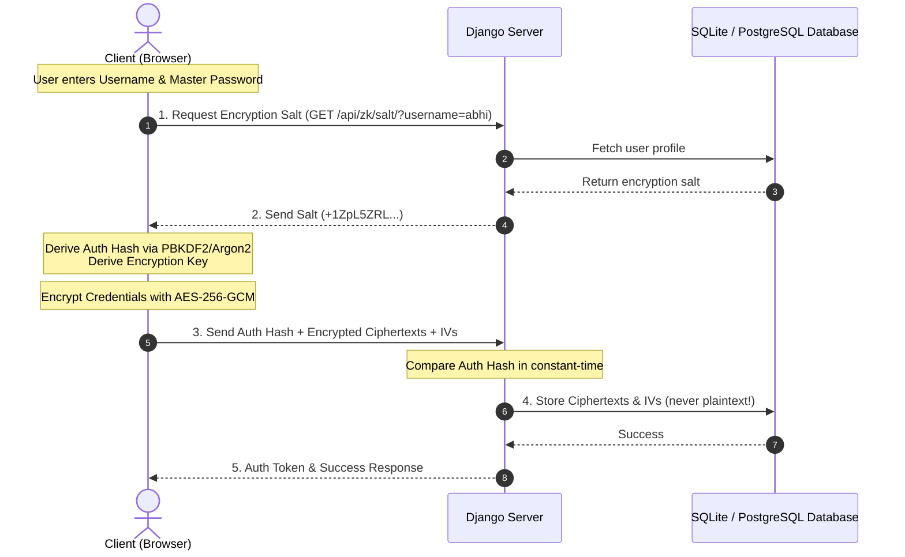

# 🔐 AccountSafe Zero-Knowledge Proof & Encrypted Values

This document provides a detailed breakdown of the **Zero-Knowledge Architecture** of **AccountSafe**, along with real database entries demonstrating that all sensitive values are fully encrypted on the client side before they reach the database.

---

## 🏗️ Architectural Flow: Zero-Knowledge (ZK) Design

The server **never** sees or stores the user's Master Password. All encryption and decryption happen exclusively in the user's browser (client-side).



### 🗝️ Core Security Principles:
1. **Unusable Passwords**: Users are registered using Django's `user.set_unusable_password()`. It is impossible to log in using standard server-side password authentication because the server does not store a password hash.
2. **Client-Side Key Derivation**: The client derives an `auth_hash` (for authentication) and an `encryption_key` (for encryption) from the Master Password. Only the `auth_hash` is sent to the server.
3. **AES-256-GCM Encryption**: Fields like `username`, `password`, `email`, and `notes` are encrypted on the client using AES-256-GCM, generating a unique **IV (Initialization Vector)** for every field to prevent pattern analysis.

---

## 🗄️ Actual Encrypted Database Dump

Below are the actual entries currently stored in your local SQLite database (`db.sqlite3`), retrieved using Django's backend model interface.

### 👤 User 1: `abhi` (Email: `abhigyan@gmail.com`)

#### 1. Zero-Knowledge Authentication & Key Details
* **Encryption Salt (Stored on Server)**:  
  `+1ZpL5ZRLO3MTjynjVLdIUXiNkkKdDQnOfQvZ83S7og=` *(Sent to client to re-derive key)*
* **Duress Salt (Stored on Server)**:  
  `f+nfK7VPkXNaXV8ZpJGVBq+LzwCqlI9/scbLC2wh5fg=` *(For duress/decoy mode)*
* **Auth Hash (Stored on Server)**:  
  `56e7de25410a518c4eb3a4d2c961d1f6b28fcb0caf62bf11499fca6fba856d3f` *(SHA-256)*
* **Duress Auth Hash (Stored on Server)**:  
  `f53a36b1eab97db6c01ee610f33d2a0ca1fca7c3b69972e657e998e317054fa3`

#### 2. Encrypted Vault Blobs
* **Main Vault Blob (Client AES-GCM)**:
  ```json
  {"ciphertext":"F96q+ic2dyaqSlGODlG2szuoSbabgVfTgUUNmckE/1kJicHbl0kBcf+fLHaa4a4QdqYOSsuw0yZ...", ...}
  ```
  *(Server has no key to decrypt this payload)*
* **Decoy Vault Blob**:
  ```json
  {"ciphertext":"2b9d4q2TegAfHoZWc7sQp5W1+9x0DUcEC2wxsZjmwbAxFNOr74aHXMJXEEEyPrjl+4Qn5osUw3Z...", ...}
  ```

#### 3. Encrypted Credentials (Profile Table)
* **Title (Stored in Plaintext for user reference)**: `nhgn` (Org: `Instagram`, Category: `Social Media`)
* **Username (Encrypted Ciphertext)**:  
  `qXFrSMc6l84bbs7cEowbNjEXUg==`
* **Username IV**:  
  `BQBj9hT2sCbz/Prs`
* **Password (Encrypted Ciphertext)**:  
  `w70kfUFNbcEG1PGHEqWe2zj5fR71yPuTZjf0Yhyi/hI=`
* **Password IV**:  
  `3JTDLAEUKcfv+tLo`
* **Email (Encrypted Ciphertext)**:  
  `oZj9eVaNX3ukTj1R4CYv6XS8+j+wmwGT4Q8fmPo=`
* **Email IV**:  
  `jcJYjxX5qy6dPkGx`
* **Password Strength (calculated client-side)**: `4` (zxcvbn score)
* **Password Hash (One-way SHA-256 for breach checks)**:  
  `427807decddb6053dbe7ca8e9aedf558bd81b1c2ef91c094be96033b7afe2df3`
* **Soft Deleted (Trash bin status)**: `False`

---

### 👤 User 2: `ds` (Email: `sdbfiub@bhxdvj.fvni`)

#### 1. Zero-Knowledge Authentication & Key Details
* **Encryption Salt**: `xFDdVaiX36y/kaArl3I2FBg1Tjn1gF0KBcL8M4gJLqc=`
* **Duress Salt**: `lMhL/863AUVYoCWPZHyNRWb+cnmTP9WOPVttwiVfCqc=`
* **Auth Hash (SHA256)**: `f8a18ef56b211007c258e320ab4990b2713228c4fdb98152867c82411063e239`
* **Duress Auth Hash**: `d97f9465e9b90e1f7f257d0a2fe6886cdeef6e5acc1e3e3ec3f2d4858fbc98cb`

#### 2. Encrypted Vault Blobs
* **Main Vault Blob**:  
  `{"ciphertext":"wA97YLebtIC0dL6LCZlcDDTBQVAb2yuBMZdDQKnmZdugWchVUt2ckzS+xlrLq801xyKwwLSxkLAEq...", ...}`
* **Decoy Vault Blob**:  
  `{"ciphertext":"fCHtpH9bQqbcIuTIrT/rOyQ4/ce6N+uHE1+j1EO2w3+M6Bc2wPLc37yHVNu5p6K4i7ZcyGL/rs1/...", ...}`

#### 3. Encrypted Credentials (Profile Table)
* **Title**: `a` (Org: `Google Drive`, Category: `Social`)
* **Username (Encrypted Ciphertext)**: `5ktHEWR52iKOs3sV5DpjLMDD`
* **Username IV**: `wrkWe+S9nc6Jx1s+`
* **Password (Encrypted Ciphertext)**: `wdDXDSpCVgHUydh4uFYBRqpXoqgsfEftJ9IglQVo4I4=`
* **Password IV**: `hfqW6Sa4o1GK5WCu`
* **Password Hash**: `32eeaeb87f5e230706fd69f204e3d0ca5b49d951dc5a85a5ff60b587a5bafecf`

---

## 🔍 How to Verify This Live for the Judge

You can demonstrate this directly to the judge by running the following command in the project terminal. It queries the database in real-time and prints these values:

```powershell
# Run the database encrypted values dump script
python backend/venv/Scripts/python.exe scratch/show_encrypted_data.py
```

### 💡 Hackathon Judge Talking Points:
1. *"Notice that we store an initialization vector (IV) for every single field. Even if two credentials have the same password, they produce completely different encrypted ciphertexts because of random IV salts."*
2. *"The database contains no plaintext passwords, emails, or notes. If an attacker compromises our Django server or accesses the database, they get absolutely zero readable data."*
3. *"The authentication hash stored in the database is derived client-side. The server has no mechanism to convert the auth_hash back into the Master Password, ensuring strict zero-knowledge security."*
